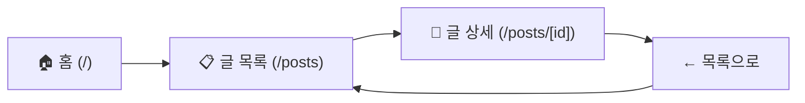
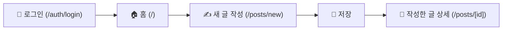
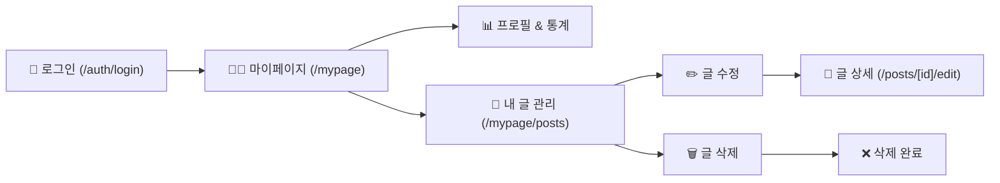

# 🏗️ 개인 블로그 프로젝트 - 아키텍처

## 📌 프로젝트 개요

**프로젝트명:** 개인 블로그 (My First Web)

**목표:** Next.js 16 + React 19 + Tailwind CSS를 활용한 풀스택 개인 블로그 서비스 구축

**주요 기능:**
- 📝 블로그 글 작성, 수정, 삭제 (CRUD)
- 👤 사용자 인증 (회원가입, 로그인)
- 📋 글 목록 및 상세 페이지
- 👨‍💼 마이페이지 및 글 관리

**기술 스택:**
- **프레임워크:** Next.js 16.2.1 (App Router)
- **UI 라이브러리:** React 19.2.4
- **스타일링:** Tailwind CSS 4
- **언어:** TypeScript
- **인증:** Supabase (예정)
- **데이터베이스:** Supabase (예정)

---

## 🗺️ 페이지 맵 (URL 구조)

### App Router 기반 파일 구조

```
app/
├── page.tsx                 # / (홈)
├── layout.tsx              # 전역 레이아웃 (헤더, 푸터, 네비게이션)
│
├── posts/
│   ├── page.tsx            # /posts (글 목록)
│   ├── new/
│   │   └── page.tsx        # /posts/new (새 글 작성)
│   ├── [id]/
│   │   ├── page.tsx        # /posts/[id] (글 상세)
│   │   └── edit/
│   │       └── page.tsx    # /posts/[id]/edit (글 수정)
│
├── auth/
│   ├── login/
│   │   └── page.tsx        # /auth/login (로그인)
│   └── signup/
│       └── page.tsx        # /auth/signup (회원가입)
│
├── mypage/
│   ├── page.tsx            # /mypage (마이페이지)
│   └── posts/
│       └── page.tsx        # /mypage/posts (내 글 관리)
│
├── globals.css             # 전역 스타일
└── not-found.tsx           # TODO: 404 페이지 (추가 예정)
```

### 페이지 상세 설명

| 페이지 | URL | 설명 | 상태 |
|--------|-----|------|------|
| 홈 | `/` | 블로그 소개, 최신 글 미리보기 | ✅ 완성 |
| 글 목록 | `/posts` | 모든 글을 카드로 표시 | ✅ 완성 |
| 글 상세 | `/posts/[id]` | 선택한 글의 전체 내용 | ✅ 완성 |
| 새 글 작성 | `/posts/new` | 새로운 글 작성 폼 | ✅ 완성 |
| 글 수정 | `/posts/[id]/edit` | 기존 글 수정 폼 | ✅ 완성 |
| 로그인 | `/auth/login` | 로그인 페이지 | ✅ 완성 |
| 회원가입 | `/auth/signup` | 회원가입 페이지 | ✅ 완성 |
| 마이페이지 | `/mypage` | 프로필, 통계, 글 관리 | ✅ 완성 |
| 내 글 관리 | `/mypage/posts` | 내 글 목록 (테이블) | ✅ 완성 |

---

## 👥 유저 플로우

### 1️⃣ 글 읽기 플로우 (로그인 없음)



**플로우 설명:**
1. 홈 페이지 방문
2. 네비게이션의 [블로그] 클릭 → 글 목록 페이지
3. 글 카드 선택 → 글 상세 페이지
4. [목록으로 돌아가기] → 글 목록으로 이동

**특징:** 누구나 접근 가능, 읽기만 가능

---

### 2️⃣ 글 작성 플로우 (로그인 필수)



**플로우 설명:**
1. [로그인] 페이지에서 인증
2. 홈 페이지로 이동
3. 네비게이션의 [새 글 쓰기] 클릭 → 글 작성 페이지
4. 제목/내용 입력 후 [저장] 버튼
5. 작성한 글의 상세 페이지로 이동

**특징:** 로그인 필수, 글 작성 권한 필요

---

### 3️⃣ 마이페이지 플로우 (글 관리)



**플로우 설명:**
1. [로그인] 페이지에서 인증
2. 네비게이션의 [마이페이지] 클릭
3. 마이페이지에서 프로필 및 통계 확인
4. [내 글 관리] 클릭 → 내 글 목록 페이지
5. 각 글의 [수정] 또는 [삭제] 버튼으로 관리
6. 수정 시 글 수정 페이지로 이동
7. 삭제 시 확인 후 삭제

**특징:** 로그인 필수, 자신의 글만 관리 가능

---

## 📁 프로젝트 구조

```
my-first-web/
├── app/                      # Next.js App Router
│   ├── page.tsx             # 홈 페이지
│   ├── layout.tsx           # 루트 레이아웃
│   ├── globals.css          # 전역 스타일
│   ├── posts/               # 글 관련 페이지
│   ├── auth/                # 인증 관련 페이지
│   └── mypage/              # 마이페이지
│
├── lib/                      # 유틸리티 및 데이터
│   ├── posts.ts             # 글 데이터 (더미 데이터)
│   └── utils.ts             # 헬퍼 함수
│
├── components/              # TODO: React 컴포넌트 (추가 예정)
│   └── ui/                  # TODO: shadcn/ui 컴포넌트 (추가 예정)
│
├── public/                  # 정적 파일
│   └── posts/              # 글 데이터 JSON (더미 데이터)
│
├── SITEMAP.md              # 페이지 맵 및 유저 플로우
├── ARCHITECTURE.md         # 이 파일 (프로젝트 아키텍처)
├── package.json            # 의존성 관리
├── tsconfig.json           # TypeScript 설정
├── tailwind.config.ts      # Tailwind CSS 설정
└── next.config.ts          # Next.js 설정
```

---

## 🔄 네비게이션 구조

### 로그인 전
```
[홈] | [블로그] | [새 글 쓰기] | [로그인]
```

### 로그인 후
```
[홈] | [블로그] | [새 글 쓰기] | [마이페이지] | [로그아웃]
```

---

## 💾 데이터 모델

### TODO: 추가 예정 (Ch8)

- 사용자 모델 (User)
- 글 모델 (Post)
- 댓글 모델 (Comment)
- 데이터베이스 스키마

---

## 🎨 컴포넌트 구조

### TODO: 추가 예정 (shadcn/ui 설치 후)

- UI 컴포넌트 (Button, Card, Input, Dialog 등)
- 공통 컴포넌트 (Header, Footer, Navigation 등)
- 기능별 컴포넌트 (PostCard, PostForm 등)

---

## 🔐 인증 시스템

### TODO: 추가 예정 (Ch11)

- Supabase 연동
- 회원가입 로직
- 로그인 로직
- JWT 토큰 관리
- 미들웨어 설정

---

## 🚀 배포

### TODO: 추가 예정

- Vercel 배포
- 환경 변수 설정
- 성능 최적화

---

## 📚 참고 문서

- [SITEMAP.md](./SITEMAP.md) - 페이지 맵 및 유저 플로우
- [Next.js App Router 공식 문서](https://nextjs.org/docs/app)
- [Tailwind CSS 공식 문서](https://tailwindcss.com)
